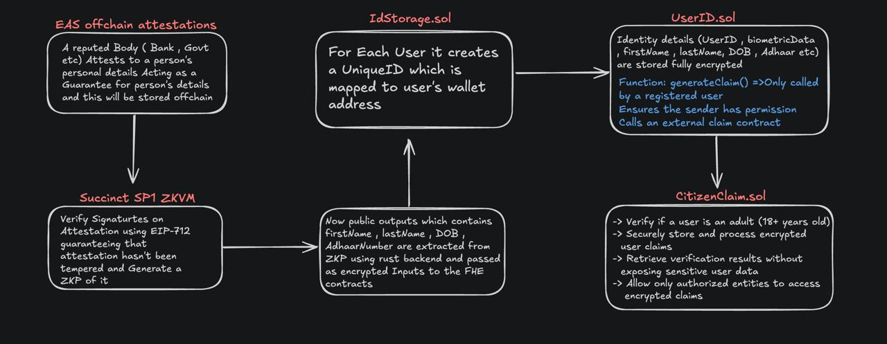
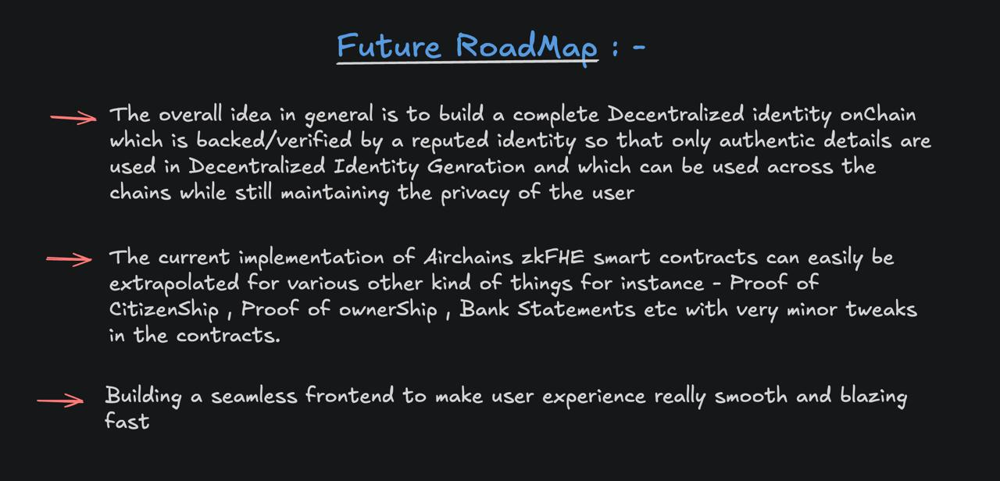

# Hands-on fhEVM

Welcome to the Hands-on fhEVM guide! 🚀

This repository provides a step-by-step guide to setting up your own fhEVM network and deploying fhEVM smart contracts. Follow the instructions below to get started.

## 📖 Overview


fhEVM (Fully Homomorphic Encryption Virtual Machine) enables encrypted computation on blockchain smart contracts. This guide walks you through the setup process, from network initialization to contract deployment and testing.

## 📂 Table of Contents

1. [Basics](./docs/01-basics.md)
2. [Architecture Overview](./docs/02-architecture-overview.md)
3. [Preparation](./docs/03-preparation.md)
4. [Setting Up Network](./docs/04-setting-up-network.md)
5. [Compiling and Deploying](./docs/05-compiling-and-deploying.md)
6. [Writing Smart Contracts](./docs/06-writing-smart-contract.md)
7. [Writing Contract Test Files](./docs/07-writing-contract-test-files.md)
8. [Conclusion](./docs/08-conclusion.md)

## 🛠️ Installation

### Prerequisites
Ensure you have the following installed:

- **Node.js (>=20)**
- **Docker (>=24) with docker compose plugin**

### Setup
Clone the repository and install dependencies:

```sh
git clone https://github.com/Shivannsh/airproof-fhe/tree/final
cd airproof-fhe
npm install
```

### Environment Configuration
Create an `.env` file and configure the necessary environment variables:

```sh
cp .env.example .env
```

### Running the Network
Follow the instructions in [Setting Up Network](./docs/04-setting-up-network.md) to start the network, then proceed through the remaining documentation to learn how to deploy and interact with smart contracts.

## 🤝 Contributing
We welcome contributions! To contribute:

1. Fork the repository.
2. Create a feature branch:
   ```sh
   git checkout -b feature/feature-name/patch-${version}
   ```
3. Commit your changes:
   ```sh
   git commit -m "Description of changes"
   ```
4. Push to your branch:
   ```sh
   git push origin feature/feature-name/patch-${version}
   ```
5. Open a Pull Request.

## 📬 Feedback and Support
If you have any feedback or encounter any issues, feel free to:

- Open an issue in this repository.
- Reach out to us at **support@airchains.network**.

## 📜 License
This project is licensed under the **MIT License**.

## 🤖 Core Contracts

### 1. `IdStorage.sol`
- **Unique ID Generation**: Assigns unique identifiers to each user
- **Address Mapping**: Securely links IDs to wallet addresses
- **Access Control**: 
  ```solidity
  function generateId() external {
      require(!hasId[msg.sender], "IdAlreadyGenerated");
      hasId[msg.sender] = true;
      addressToId[msg.sender] = nextId;
      idToAddress[nextId] = msg.sender;
      nextId++;
  }
  ```

### 2. `UserID.sol`
- **Encrypted Identity Storage**:
  - First/Last Name
  - Date of Birth (FHE-encrypted)
  - Biometric Data
  - Government ID Numbers
- **Claim Generation**:
  ```solidity
  function generateClaim() external onlyRegistered {
      require(permissions[msg.sender], "Unauthorized");
      ICitizenClaim(claimContract).verifyAdult(msg.sender);
  }
  ```

### 3. `CitizenClaim.sol`
- **Age Verification System**:
  ```solidity
  function verifyAdult(address user) external {
      euint32 dob = IUserID(userIDContract).getDOB(user);
      ebool isAdult = TFHE.lt(dob, getThresholdDate());
      _storeVerification(user, isAdult);
  }
  ```
- **Zero-Knowledge Access**:
  - Encrypted result retrieval
  - Permissioned decryption

## 🔄 Workflow
1. Off-chain Attestation → ZK Proof Generation
2. Public Output Extraction → FHE Contract Inputs
3. ID Assignment → Encrypted Storage
4. Claim Verification → Privacy-Preserving Result


*Figure 1: Workflow*

## 🛣️ Future Roadmap
- **Decentralized Identity System**
  - Cross-chain privacy preservation
  - Anti-Sybil attack mechanisms
- **zkFHE Expansion**
  - Proof of Citizenship
  - Asset Ownership Verification
  - Financial History Validation
- **Frontend Integration**
  - Encrypted form handling
  - ZKP generation UI
  - Real-time verification status

*Figure 2: Future Roadmap*
